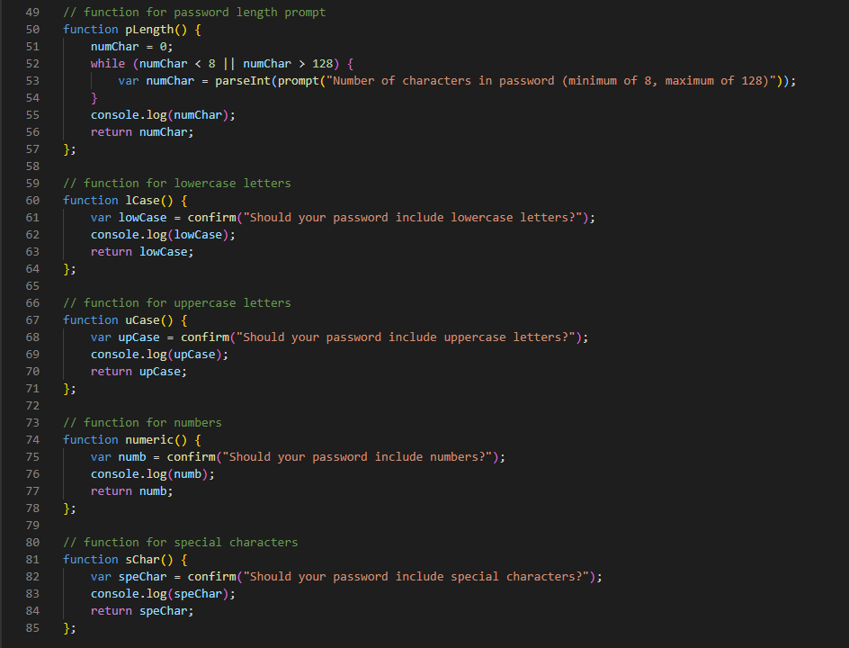
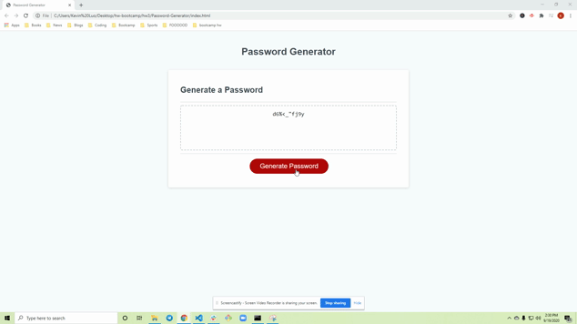

# Password-Generator Based On User-Selected Criteria

## Description
In this repository you'll find the code behind the random password-generator site. As you might have guessed, this site provides the user with a randomly generated password based on a set of criteria presented to the user. The presented criteria mimics common requirements for password creation, including: lowercase letters, uppercase letters, numbers, special characters, and desired password length. The main benefits derived from this site are the password customizability, and ease of use. The user simply specifies the password length and the type of characters needed, and is presented with a compatible password. 

The main takeaways from working on this project were the importance of pseudocoding and the benefits of splitting up tasks amongst different functions. Creating a rough layout/roadmap is a great method for organizing your thoughts before writing out the code itself. Pseudocoding also gives you a sense of how the code should be ordered, and how functions/variables should be connected within your code. Splitting up tasks amongst different functions allows for easier debugging and testing as you write the code. It also adds the benefit of making the code more readable. 

## Table of Contents
* Process
* Usage
* Credits
* Contributing
* License

## Process
The first step in creating this site was to create functions for each of the password criteria. Since the addEventListener was already hooked to the Generate Password button, all the password criteria functions were able to be called by clicking the button. In each of these functions the user response was recorded in a variable that was declared within each function's scope. Additionally, I console logged the response for each criteria to test the functions. 

Shows the separation of tasks into different functions:

The next step was assigning character string sets to global variables. I declared variables for each of the password criteria: lowercase letters, uppercase letters, numbers, and special characters. In creating the special characters string, i had to use the escape character "\\\" to include the double quotes (") and the back-slash (\\\) characters. By separating the password criteria into multiple variables, I figured that I could concatenate the strings based on the user-desired password criteria.

The customizability aspect of the site was the next step. In the generatePassword function, I created variables to store the return values for each password criteria. Two other variables were created to store the final generated password (var finalString) and the character set (var charList) for the password generator to choose from - both of these were initially assigned empty strings, that way every time the user clicked the Generate Password button, these variables would effectively be reset to empty strings. 

I then added if statements for each of the password criteria; if the user requested a certain criteria it would be concatenated to var charList. If none of the password criteria were requested, an alert would show up stating that the password should contain at least one of the presented criteria. After going through the if statements, a for loop would run based on the number of characters desired in the password. In each iteration, a random character would be chosen from var charList and concatenated to var finalString. After the final iteration, the generatePassword function returns var finalString containing the customized password. Finally, in the writePassword function, I set the textContent of the textarea element with the ID of "password" equal to the return value of generatePassword, which prints out the generated password into the text area.

## Usage
To use this site, simply click the Generate Password button and follow the alert buttons that follow:

If you choose none of the presented password criteria, you will be presented with an alert telling you to select at least one of the criteria:

## License
© 2019 Trilogy Education Services, a 2U, Inc. brand. All Rights Reserved.

Licensed under the [MIT](https://github.com/microsoft/vscode/blob/master/LICENSE.txt) License.